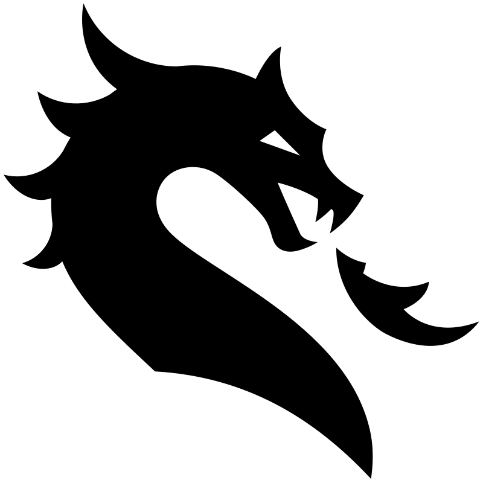
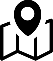
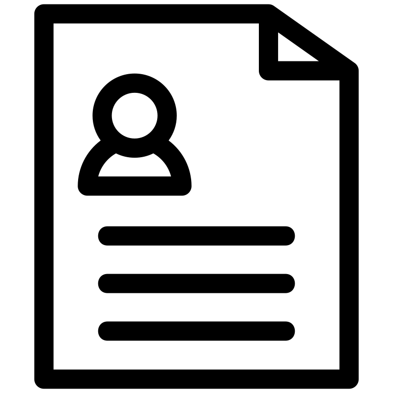
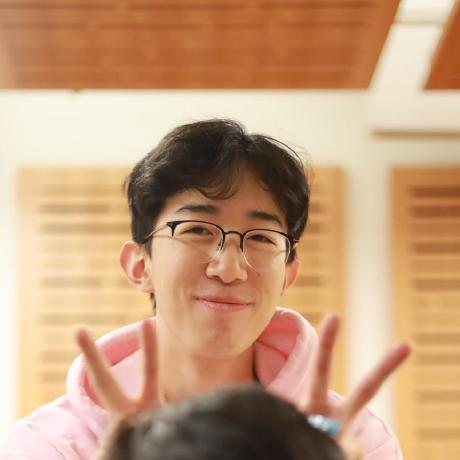

---
aliases:
  - ...
title: HOME
---

VIOLENCE is a science fantasy and horror multimedia series and worldbuilding project first created by Andrei "Aming" Cristian, revolving around the interaction between two alternate dimensions and its inhabitants. Viewer discretion is advised, as this series contains scenes and mentions of explicit gore, blood, and violence. Obviously.
 

---

  <a href="/books" style="display:flex;flex-direction:column;align-items:center;justify-content:center;gap:20px;padding:64px 24px;border:1px solid white;border-radius:8px;background:transparent;color:white;text-decoration:none;transition:transform 0.15s ease;" onmouseover="this.style.transform='scale(1.06)'" onmouseout="this.style.transform='scale(1)'">
    
    BOOKS
  </a>

  <a href="/bestiary" style="display:flex;flex-direction:column;align-items:center;justify-content:center;gap:20px;padding:64px 24px;border:1px solid white;border-radius:8px;background:transparent;color:white;text-decoration:none;transition:transform 0.15s ease;" onmouseover="this.style.transform='scale(1.06)'" onmouseout="this.style.transform='scale(1)'">
    
    BESTIARY
  </a>

  <a href="/map" style="display:flex;flex-direction:column;align-items:center;justify-content:center;gap:20px;padding:64px 24px;border:1px solid white;border-radius:8px;background:transparent;color:white;text-decoration:none;transition:transform 0.15s ease;" onmouseover="this.style.transform='scale(1.06)'" onmouseout="this.style.transform='scale(1)'">
    
    MAP
  </a>

  <a href="/dossier" style="display:flex;flex-direction:column;align-items:center;justify-content:center;gap:20px;padding:64px 24px;border:1px solid white;border-radius:8px;background:transparent;color:white;text-decoration:none;transition:transform 0.15s ease;" onmouseover="this.style.transform='scale(1.06)'" onmouseout="this.style.transform='scale(1)'">
    
    DOSSIER
  </a>

---

# CREDITS 
 

# .aming // director, writer

Hello! I am the creator of this series, that is me. It originally started as a crackfic between... I want to say Control, Devil May Cry and... Evangelion, I think? The worldbuilding and writing went through multiple stages, most of which were kitchen sinks, to be entirely honest. The versions you're currently seeing are the most refined yet, and unfortunately, the sky's the limit and I'm Icarus.

    

# .jackyzha0 // quartz

If you were wondering: yes, this site is made using Quartz, or rather a highly customised (and butchered) version of it. For those not in the known, it's allows me to directly turn Markdown files into HTMLs, and then into a functioning website. Legally, I'm pretty sure I can omit mentioning him, but it didn't sit right, so here he is.

